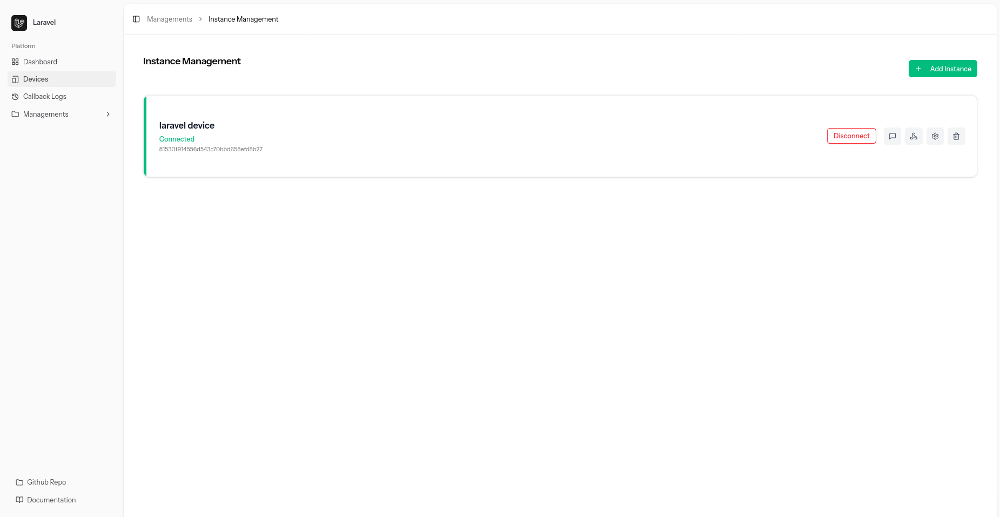

# Voda

A powerful WhatsApp management application built with **Laravel 12**, **Inertia.js v2**, **Vue 3** and **WuzAPI**.



## ✨ Features

### ✅ Completed

- **Manage WhatsApp Instance**: Connect and manage devices.
- **Send Message (Image & Video)**: Send multimedia messages directly.
- **Callback Log**: Monitor and view detailed logs of incoming callbacks (messages, status updates).
- **Webhook Management**: Configure and manage webhooks for device events.

### 🚧 Coming Soon

- **Webhook API**: API endpoints for managing webhooks programmatically.
- **Send Text, Image, Video API**: Public API for sending messages.
- **AI Integration**: AI-powered response and interaction auditing.

## 📦 Tech Stack

- **Laravel**: Web Application Framework
- **Inertia.js**: Server-driven Single Page Apps
- **Vue.js**: Progressive JavaScript Framework
- **WuzAPI**: WhatsApp API Gateway ([https://github.com/asternic/wuzapi](https://github.com/asternic/wuzapi))

## 🛠 Installation

Follow these steps to set up the project locally.

### Prerequisites

- PHP >= 8.2
- Composer
- Node.js & NPM

### Steps

1.  **Clone the Repository**

    ```bash
    git clone
    cd voda
    ```

2.  **Install PHP Dependencies**

    ```bash
    composer install
    ```

3.  **Setup Environment Variables**
    Copy the example entry file and configure your database settings.

    ```bash
    cp .env.example .env
    ```

4.  **Generate Application Key**

    ```bash
    php artisan key:generate
    ```

5.  **Run Database Migrations**

    ```bash
    php artisan migrate --seed
    ```

6.  **Install Node Dependencies**

    ```bash
    npm install
    ```

7.  **Start Development Server**

    ```bash
    php artisan serve
    ```

    ```bash
    npm run dev
    ```

    Access the application at `http://localhost:8000`.
